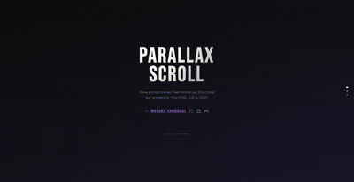

# Parallax Scroll — Advanced Sticky Section

A cinematic, scroll-driven parallax experience built with **pure HTML, CSS, and GSAP ScrollTrigger**. No frameworks. No build tools. Just open and scroll.



---

## ✨ Features

- **Sticky scroll pinning** — a 300vh wrapper with a `position: sticky` stage gives three full-screen slides without any scroll hijacking
- **Thunder flash entrance** — multi-strike CSS brightness keyframes that fire *after* the background is fully visible, simulating a real lightning effect
- **Idle thunder loop** — while you stay on a slide, random single flashes fire at unpredictable intervals (3–8 seconds), like a live thunderstorm
- **Directional animations** — title and paragraph slide in from above on enter, exit downward on leave; fully reverses when scrolling back up
- **Button animation** — enters from the left, exits to the right, contrasting the vertical text motion
- **Lenis smooth scroll** — buttery smooth wheel and touch scrolling, integrated with GSAP's ticker so ScrollTrigger stays perfectly in sync
- **Progress dots** — clickable fixed navigation dots that jump to any slide
- **Gradient progress bar** — a thin top bar reflecting overall scroll position across all three slides
- **Slide counter** — live `01 / 03` indicator shown while the parallax is active
- **Fully reversible** — every animation works identically when scrolling up

---

## 🛠 Tech Stack

| Tool | Purpose | How it's loaded |
|---|---|---|
| [GSAP 3.12.5](https://gsap.com) | Animation engine + ScrollTrigger | cdnjs CDN |
| [Lenis 1.1.14](https://github.com/darkroomengineering/lenis) | Smooth scroll | unpkg CDN |
| [Google Fonts](https://fonts.google.com) | Bebas Neue + DM Sans | fonts.googleapis.com |

No npm. No bundler. No config files.

---

## 📁 Project Structure

```
parallax-scroll/
├── index.html                  # Everything — HTML, CSS, JS in one file
├── README.md
└── assets/
    └── images/
        ├── photo-1478760329108-5c3ed9d495a0.jpeg   # Slide 1 background
        ├── jack-b-VNNMDyZafA0-unsplash.jpg          # Slide 2 background
        └── wes-hicks-6biN3uBw4Fg-unsplash.jpg       # Slide 3 background
```

---

## 🚀 Getting Started

1. **Clone the repository**
   ```bash
   git clone https://github.com/malakasandakalw/parallax-scroll.git](https://github.com/malakasandakalw/thundering-parallax.git
   ```

2. **Open in a browser**

   No server required for most browsers. Simply open `index.html`:
   ```bash
   open index.html        # macOS
   start index.html       # Windows
   xdg-open index.html    # Linux
   ```

   > **Note:** If background images don't load, serve the project locally. Use VS Code Live Server, or run:
   > ```bash
   > npx serve .
   > ```

3. **Scroll down** — the parallax section locks to the viewport and the three scenes animate through.

---

## 🎨 Customisation

### Changing Slide Content

Each slide lives in `#parallax-wrapper`. Edit the title, paragraph, and button text directly in the HTML:

```html
<div class="slide slide--1" id="slide-1">
  <div class="slide__bg"></div>
  <div class="slide__overlay"></div>
  <div class="slide__number">01</div>
  <div class="slide__content">
    <h2 class="slide__title">Your Title Here</h2>
    <p class="slide__para">Your paragraph here.</p>
    <button class="slide__btn">Your CTA</button>
  </div>
</div>
```

### Changing Background Images

Update the CSS background-image paths for each slide:

```css
.slide--1 .slide__bg {
  background-image:
    linear-gradient(35deg, rgba(10,10,10,0.15) 0%, rgba(10,10,10,0.35) 100%),
    url('/assets/images/your-image.jpg');
}
```

### Changing Accent Colours

Three CSS custom properties control the title and button colours per slide:

```css
:root {
  --accent-1: #e8c547;  /* Slide 1 — yellow */
  --accent-2: #ff6b6b;  /* Slide 2 — coral  */
  --accent-3: #4ecdc4;  /* Slide 3 — teal   */
}
```

### Adjusting the Overlay Darkness

The dark gradient between the background image and the text:

```css
.slide__overlay {
  background: linear-gradient(
    to bottom,
    rgba(0,0,0,0.10) 0%,   /* top — lightest */
    rgba(0,0,0,0.38) 60%,  /* middle         */
    rgba(0,0,0,0.55) 100%  /* bottom — darkest, where text lives */
  );
}
```

Raise the values toward `1.0` for a darker overlay, lower them toward `0.0` for more image visibility.

### Adding More Slides

1. Increase the wrapper height — add `100vh` per new slide:
   ```css
   #parallax-wrapper { height: 400vh; } /* for 4 slides */
   ```

2. Add a new slide block to `#parallax-stage`:
   ```html
   <div class="slide slide--4" id="slide-4"> ... </div>
   ```

3. Add its background image in CSS:
   ```css
   .slide--4 .slide__bg { background-image: url('...'); }
   ```

4. Add a new dot to `#progress-dots`:
   ```html
   <div class="dot" data-slide="3"></div>
   ```

5. Update `SLIDE_COUNT` is automatically inferred from `.slide` elements — no JS change needed.

### Thunder Timing

Control how fast the entrance thunder plays and how often idle flashes fire:

```js
// Entrance thunder delay after bg appears (ms)
setTimeout(() => { ... }, 820);

// Idle thunder interval — random between these two values (ms)
const delay = 3000 + Math.random() * 5000; // 3s – 8s
```

### Smooth Scroll Speed

Lenis duration controls how long a scroll gesture takes to settle:

```js
const lenis = new Lenis({
  duration: 1.4,  // seconds — increase for slower, decrease for snappier
});
```

---

## 🧠 How It Works

### The Sticky Stage Trick

```
#parallax-wrapper  →  height: 300vh   (creates 3 screens of scroll distance)
  #parallax-stage  →  position: sticky; top: 0; height: 100vh
```

The stage never actually moves. The user scrolls through the tall wrapper while the stage stays locked to the top of the viewport. GSAP's ScrollTrigger watches the wrapper and maps its `0 → 1` progress to slide indices.

### Slide Transitions

```js
const slideIndex = Math.min(Math.floor(progress * SLIDE_COUNT), SLIDE_COUNT - 1);
```

Every scroll tick checks whether the slide index has changed. If it has, `exitSlide()` runs on the old one and `enterSlide()` runs on the new one. The `direction` value (`1` = down, `-1` = up) is passed to both functions so animations flip axes automatically — this is what makes scrolling up work for free.

### Thunder Sequence

```
bg fades in (0.8s)
    └── 820ms delay
        └── thunder keyframe fires (2s) — 4 brightness spikes
                └── 2100ms later
                    └── idle loop starts (random 3–8s intervals)
```

### Animation Layer Order

```
z-index 0  →  .slide__bg       (background image + thunder)
z-index 1  →  .slide__overlay  (dark gradient, always visible)
z-index 1  →  .slide__number   (decorative, behind content)
z-index 2  →  .slide__content  (title, paragraph, button)
```

---

## 📦 Dependencies (CDN — no installation needed)

```html
<!-- GSAP animation engine -->
<script src="https://cdnjs.cloudflare.com/ajax/libs/gsap/3.12.5/gsap.min.js"></script>

<!-- GSAP ScrollTrigger plugin -->
<script src="https://cdnjs.cloudflare.com/ajax/libs/gsap/3.12.5/ScrollTrigger.min.js"></script>

<!-- Lenis smooth scroll -->
<script src="https://unpkg.com/lenis@1.1.14/dist/lenis.min.js"></script>
```

---

## 🌐 Browser Support

| Browser | Support |
|---|---|
| Chrome 90+ | ✅ Full |
| Firefox 88+ | ✅ Full |
| Safari 14+ | ✅ Full |
| Edge 90+ | ✅ Full |
| Mobile (iOS/Android) | ✅ Full |

`position: sticky`, `filter: brightness()`, and CSS custom properties are all broadly supported in modern browsers.

**Malaka Sandakal**

[](https://github.com/malakasandakalw)
[](https://www.linkedin.com/in/malakasandakal/)
[](mailto:malakasandakalw@gmail.com)
